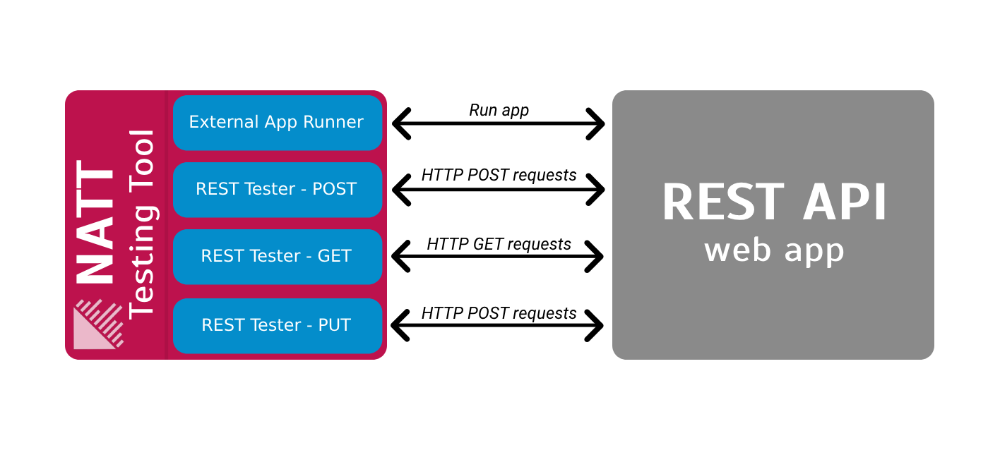
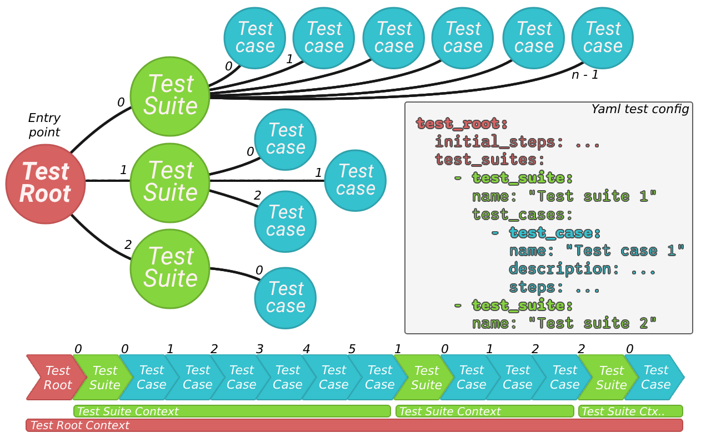

<div align="center">
  
  <h1>Network Application Testing Tool (NATT)</h1>
  <div>
    
    
    
    
    
  </div>
  <i>Created as part of the thesis at UTB</i>
</div>

# 💡 Description of testing tool

This **Black Box** Testing Tool is designed for automating the testing and evaluation of tasks without requiring knowledge of the software's internal structure or implementation details. It offers several key features:

- **Universality**: The tool supports testing various types of software applications regardless of their implementation details.
- **Separation**: Emphasizes the separation of the evaluation application and its internal logic from the tested tasks.
- **Independence**: The tool operates independently of external network resources, allowing it to create virtual servers and clients for testing purposes.
- **Flexibility**: Users can easily define new test sets using specific keywords in the configuration.



## What does the tool allow you to test?

* Testing simple __email__ sending applications
* Testing __clients__ that use the telnet protocol
* Testing __servers__ that use the telnet protocol
* Testing applications communicating through __REST API__
* Testing __SOAP web services__
* Testing __MQTT clients__
* Testing __Web crawlers__
* The __tested__ applications can be written __in any language__

## Helpful links

* **Configuration keyword list: [keywords.md](./keywords.md)**

* **Configuration editor: [config-editor](./config-editor)**

* Test suite configuration for all task types: [configuration-examples](./configuration-examples)

* Simple example project: [project-example](./project-example)

## System Requirements

* **Operating System:** Linux, Windows 7 or later, MacOS 10.12 (Sierra) or later

* **Java Development Kit (JDK):** JDK 17 or later

* **Gradle:** Gradle 8.7 or later

## How to build testing tool?

You can use gradle wrapper:

```
./gradlew build
```

Or using custom script that builds the tool and deploys it to the configuration editor. Configuration editor require NATT.jar:

```
./fast_build_and_move_to_editor.sh
```

## Testing diagrams 

These two diagrams illustrate how application testing is conducted using the **NATT** black box testing tool. On the left side, there is the testing tool which communicates with the tested application through modules (colored blue in the picture). The communication is then evaluated for the purpose of testing. It is verified whether the tested application behaves according to defined expectations.


**The testing tool offers several different modules that can be created and combined as needed for the specific testing requirements.** 


## Supports running test on **localhost** or in **CI/CD** pipeline

Basic GitLab CI/CD pipeline configuration with automatic test execution. The repository must contain the NATT.jar file as well as the configuration with the test suites.

```yaml
image: gradle:alpine

before_script:
  - GRADLE_USER_HOME="$(pwd)/.gradle"
  - export GRADLE_USER_HOME

stages:
  - build
  - test

build_application:
  stage: build
  script:
    - ./gradlew build
  artifacts:
    paths:
      - app/build/libs/*.jar
  allow_failure: false

black_box_testing:
  stage: test
  script:
    - java -jar NATT.jar -c test-config.yaml
  artifacts:
    paths:
      - test_report.html
  dependencies:
    - build_application
  allow_failure: false
```

## How to run testing tool

For help, specify the -h or --help argument.

```bash
java -jar NATT.jar -c <path-to-test-config>
```

## Future improvements

* The possibility of defining your own keywords
* The possibility of launching more than one external applications at one time
* Add path variable support for REST API testing
* Add more testing options when testing the web crawler
* Add additional modules for testing other types of applications: client testing using SSL, UI testing, ...

# 🔧 Configuring of the Testing Tool

In order to ensure the versatility of our black box testing tool, we've devised a straightforward method for users to convey precisely what tasks they want the tool to undertake. This is achieved through the utilization of YAML-formatted configurations for test sets. These configurations serve as blueprints, enabling the tool to execute tasks reliably and efficiently.

The configuration language of our tool is designed to be intuitive, comprising a set of keywords that users can easily manipulate to tailor their testing requirements. Writing configurations for our tool is akin to crafting configurations for GitLab CI/CD pipelines, ensuring familiarity and ease of use for those experienced with such processes.

## Configuration editor

For NATT black box testing tool was also created simple "IDE". It allows you to create and edit configurations without the need to write them in YAML. 
**More about it you can finde [here](./config-editor/README.md).**

## 🧩 Understanding Test Structures

Let's dive into the structure of tests in our tool. The image below this text shows a diagram of our test framework, the core of which comes from the Test Root node. This basic element, paramount in any configuration, determines the overarching setting for the testing process. All test suites are defined in this root element.



# 📩 Variables and Received Messages

During testing, you have the flexibility to work with variable contents or with a message buffer containing all messages received during testing. The content of the received message buffer is automatically cleared upon the completion of each test case. Variables are only accessible within the context in which they were created. Therefore, if a variable is created within a test case, it will only be available within that specific test case. There's no need to declare a variable before writing to it; simply input the desired content, and if it doesn't exist, it will be automatically created.

### Important:
* **Variable** - Contains arbitrary data into which information is inserted during test execution. These variables are automatically populated by the tool. The variable **'(module-name)-last-msg'** holds the content of the message received last by a given module. The variable **'(module-name)-action-msg'** contains the content of the message that triggered the termination of waiting (**'wait_until'** keyword).

* **Message Buffer** - Contains all messages received during the entire testing process. Messages are accessible only within the scope of a test case.

> **(module-name)** is the unique name of the module. The name of the module is always defined when it is created

# 🔠 Inserting Variables into Strings

Accessing the content of variables can be achieved using specific keywords tailored for this purpose, or their values can be directly inserted into any parameter of any keyword in the configuration. However, the parameter must be of string type. Simply insert the name of the variable preceded by **'$'** into the desired string. For example, in the following manner:  **"Text $var1 Text"**. Name of variable is **"var1"**.

# 🔑 Keywords

This section provides a brief description of all the keywords that the tool allows execution of. Each keyword has a unique name and a set of parameters that must be configured. A keyword can contain any number of parameters. Parameters can be of type string, boolean, double, long, or list. For lists, all values must be of the same type. The value of a parameter can also contain additional nested keywords.

All keywords are executed synchronously. If any keyword has a parameter of the "delay" type. Its enable a delayed call, then the keyword is executed asynchronously.

**Description for all keywords you can find here [keywords.md](./keywords.md)**

# 📦 Working with Communication Modules

Each module has its specific behavior and ways in which it needs to be handled. This section describes each of them and the methods to properly utilize their functionality when writing testing configurations.

Upon receiving a message by any module, its content is appropriately processed and inserted into the message buffer. In all cases, the content of this last received message is also stored in a variable with the following name format: "<module-name>-last-msg". Using this variable can significantly simplify configuration writing in certain cases.

## External Application Runner
This module is automatically created before the actual testing begins, and it's not necessary to create it manually. It's not possible to create multiple instances of this module.

For message sending use **'standard_stream_send'** instead of **'module_send'**.

Messages received by this module are inserted into the message buffer. The tag of each inserted message is set to an empty value.

## Telnet Client Module
This module must be created before its functionalities are utilized during testing. Multiple instances of this module can exist within a testing suite. The same applies to all other modules unless stated otherwise.

Messages sent using the 'module_send' keyword to this module **don't require any specific format**. It sends any passed text string.

Messages received by this module are inserted into the message buffer. The tag of each inserted message is set to an empty value.

## Telnet Server Module
For the Telnet server, messages sent using the 'module_send' keyword **don't require any specific format**. It sends any passed text string to all connected clients.

All messages from clients received by this module are inserted into the message buffer. The tag of each inserted message is set to the ID of the client that sent the message. The client ID follows the format **"client-#"** where **#** represents the client number. The client number depends on the order in which they connected to the server. The first connected client will have the ID **"client-1"**, the second will have  **"client-2"**, and so on.

## SMTP Email Server Module
This module **does not support sending** messages using the 'module_send' keyword. It only starts the email server and accepts emails.

The content of all emails received by this module is inserted into the message buffer. The tag of each inserted message is set to the **subject value** of the respective email.

## REST Tester Module
For the REST tester module, the message content sent using the 'module_send' keyword must **have a specific format**. The text sent by this module can contain multiple parameters. For this purpose, the text in the message must be in the following format: <code>**<name_1>=<value_1>;<name_2>=<value_2>**</code>

Where **"name"** is the parameter name to be inserted into the query string. If this name starts with the prefix **'#'**, its content will be inserted into the request body. 
All responses to requests from the server received by this module are inserted into the message buffer in **JSON format**. The tag of each inserted message is set to the **endpoint address** from which the response was received.

## SOAP Tester Module
For the SOAP tester module, the message content sent using the 'module_send' keyword must **have a specific format**. The sent request content must be in XML format, and its structure must be as required by the tested SOAP web service. 
The request can be entered manually or loaded directly from a prepared file, and the loaded content can be sent using this method. 

All responses to requests from the server received by this module are inserted into the message buffer. Each message is converted **from XML to JSON format before insertion**. The tag of each inserted message is set to the **endpoint address** from which the response was received.

## MQTT Client Module
For the MQTT client module, the message content sent using the 'module_send' keyword must **have a specific format**. The message must specify the topic and the content of the message. The format is as follows: <code>**(topic):(Message)**</code>

Messages received by this module are inserted into the message buffer as they were received. The tag of each message is set to the value of the **topic** from which the message was received.

## MQTT Broker Module
This module **does not support** sending messages using the 'module_send' keyword. The module simply starts an MQTT broker and facilitates its operation. The module does not allow receiving incoming communication either. It acts solely as a mediator for MQTT communication between clients connected to it.

# 🧪 Test Configuration Samples

**More examples in this direcotry [configuration-examples](./configuration-examples)**

## Testing of simple application for email sending

This configuration defines a set of automatic tests to evaluate the functionality of the email client application for sending email. The tests include scenarios related to sending emails. Each test case is designed to simulate different user interactions and verify that the client behaves as expected.

```yaml
test_root:
  max_points: 4.0
  initial_steps: 
    - create_email_server:
        name: "server-1"
        port: 9999
  test_suites: 
    - test_suite:
        name: "Basic Email Sending Test"
        delay: 500
        test_cases: 
          - test_case:
              name: "Email Sending Test"
              description: "Tests the sending of one email. The content of the sent email is not verified, only whether it arrived at the server."
              steps: 
                - run_app: "java -jar app/build/libs/app.jar localhost 9999 sender@email.com recipient@email.com Subject1 'Text Message'"
                - wait_until:
                    module_name: "server-1"
                    time_out: 5000
                - count_and_store:
                    var_name: "var-1"
                    module_name: "server-1"
                - assert_equals:
                    var_name: "var-1"
                    value: 1
                - wait: 500
          - test_case:
              name: "Email Content Test 1"
              description: "Tests the sending of one email. After receiving the email, its content is verified."
              steps: 
                - run_app: "java -jar app/build/libs/app.jar localhost 9999 sender@email.com recipient@email.com Subject1 'Text Message'"
                - wait_until:
                    module_name: "server-1"
                    time_out: 5000
                - store_to_var:
                    var_name: "var-1"
                    module_name: "server-1"
                    tag: "Subject1"
                    mode: "equals"
                - assert_string:
                    var_name: "var-1"
                    expected: "Text Message"
                    mode: "equals"
                    case_sensitive: true
                - wait: 500
          - test_case:
              name: "Email Content Test 2"
              description: "Tests the sending of one email. After receiving the email, its content is verified."
              steps: 
                - run_app: "java -jar app/build/libs/app.jar localhost 9999 sender@email.com recipient@email.com Subject1111 'Lorem ipsum dolor sit amet, consectetuer adipiscing elit. Proin mattis lacinia justo. Curabitur bibendum justo non orci. Sed ut perspiciatis unde omnis iste natus error sit voluptatem accusantium doloremque laudantium, totam rem aperiam, eaque ipsa quae ab illo inventore veritatis et quasi architecto beatae vitae dicta sunt explicabo.'"
                - wait_until:
                    module_name: "server-1"
                    time_out: 5000
                - store_to_var:
                    var_name: "var-1"
                    module_name: "server-1"
                    tag: "Subject1111"
                    mode: "equals"
                - assert_string:
                    var_name: "var-1"
                    expected: "Lorem ipsum dolor sit amet, consectetuer adipiscing elit. Proin mattis lacinia justo. Curabitur bibendum justo non orci. Sed ut perspiciatis unde omnis iste natus error sit voluptatem accusantium doloremque laudantium, totam rem aperiam, eaque ipsa quae ab illo inventore veritatis et quasi architecto beatae vitae dicta sunt explicabo."
                    mode: "contains"
                    case_sensitive: true
                - wait: 500
          - test_case:
              name: "Invalid Email Sending Test"
              description: "An email with invalid data is sent through the tested application. It is assumed that the email will not be sent."
              steps: 
                - run_app: "java -jar app/build/libs/app.jar localhost 9999 sender@email.com recipient@email.com"
                - wait: 3000
                - count_and_store:
                    var_name: "var-1"
                    module_name: "server-1"
                - assert_equals:
                    var_name: "var-1"
                    value: 0
                - wait: 500
```

## Testing of telnet client

This configuration describes a series of automated tests designed to assess the functionality of the telnet client application. The tests are structured to verify both the sending and receiving capabilities of the telnet client. Each test case simulates different scenarios to see if the client works correctly under different conditions.

```yaml
test_root:
  max_points: 4.0
  initial_steps: 
    # Start a virtual telnet server on port 9999
    - create_telnet_server:
        name: "tel-server-1"
        port: 9999
  test_suites: 
    - test_suite:
        name: "Message Sending Test"
        delay: 700
        initial_steps: 
          - run_app: "java -jar app/build/libs/app.jar localhost 9999"
          - wait: 200
        test_cases: 
          - test_case:
              name: "Message Sending Test 1"
              description: "The tested telnet client sends several test messages to the server and then verifies whether these messages were delivered correctly."
              steps: 
                # Test application sends messages via std in for sending
                - standard_stream_send: "This is test message 1"
                - wait: 500
                - standard_stream_send: "Next test message"
                - wait: 1200
                # Verify received messages
                - buffer_get:
                    var_name: "var-1"
                    module_name: "tel-server-1"
                    index: 0
                - buffer_get:
                    var_name: "var-2"
                    module_name: "tel-server-1"
                    index: 1
                - assert_string:
                    var_name: "var-1"
                    expected: "This is test message 1"
                    mode: "equals"
                    case_sensitive: true
                - assert_string:
                    var_name: "var-2"
                    expected: "Next test message"
                    mode: "equals"
                    case_sensitive: true
          - test_case:
              name: "Message Sending Test 2"
              description: "The tested telnet client sends many messages to the server in a short time. It will be verified whether all of them were delivered."
              steps:
                # Test application sends messages via std in for sending
                - standard_stream_send: "This is test message 1"
                - standard_stream_send: "This is test message 2"
                - standard_stream_send: "This is test message 3"
                - standard_stream_send: "This is test message 4"
                - standard_stream_send: "This is test message 5"
                - wait: 1200
                # Verify received messages
                - store_to_var:
                    var_name: "var-1"
                    module_name: "tel-server-1"
                    text: "This is test message 3"
                    mode: "equals"
                    case_sensitive: true
                - assert_string:
                    var_name: "var-1"
                    expected: "This is test message 3"
                    mode: "equals"
                    case_sensitive: true
                - count_and_store:
                    var_name: "var-2"
                    module_name: "tel-server-1"
                - assert_equals:
                    var_name: "var-2"
                    value: 5
          - test_case:
              name: "Message Sending Test 3"
              description: "Several messages will be sent. It will be tested whether the list of received messages does not contain messages that were not sent (but were sent by the previous TC)."
              steps:
                # Test application sends messages via std in for sending
                - standard_stream_send: "This is test message 1"
                - standard_stream_send: "This is test message 3"
                - standard_stream_send: "This is test message 5"
                - wait: 1200
                # Verify that the list of received messages does not contain a message that was not sent (but was sent by the previous TC)
                - store_to_var:
                    var_name: "var-1"
                    module_name: "tel-server-1"
                    text: "This is test message 4"
                    mode: "equals"
                    case_sensitive: true
                - assert_string:
                    var_name: "var-1"
                    expected: ""
                    mode: "equals"
                    case_sensitive: true
    - test_suite:
        name: "Message Receiving Test"
        delay: 700
        initial_steps: 
          - run_app: "java -jar app/build/libs/app.jar localhost 9999"
          - wait: 200
        test_cases: 
          - test_case:
              name: "Message Receiving Test 1"
              description: "The virtual server sends a message to the connected telnet client, and it will be tested whether the client received this message correctly."
              steps: 
                # Send a message to the test application
                - module_send:
                    name: "tel-server-1"
                    message: "This is message from server"
                - wait: 1200
                # Verify received content
                - buffer_get:
                    var_name: "var-1"
                    module_name: "app-std-out"
                    index: 0
                - assert_string:
                    var_name: "var-1"
                    expected: "This is message from server"

```


