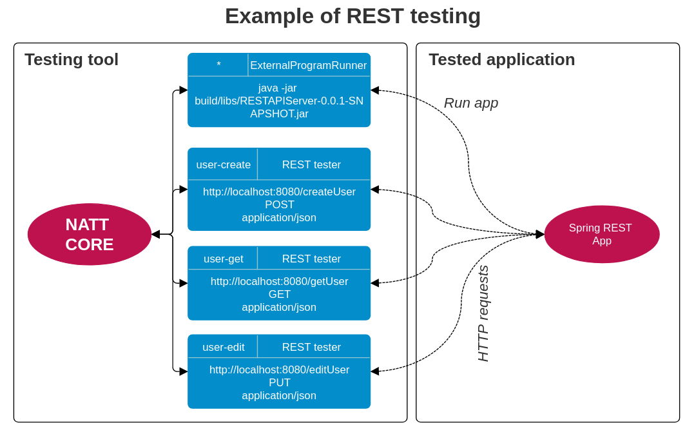
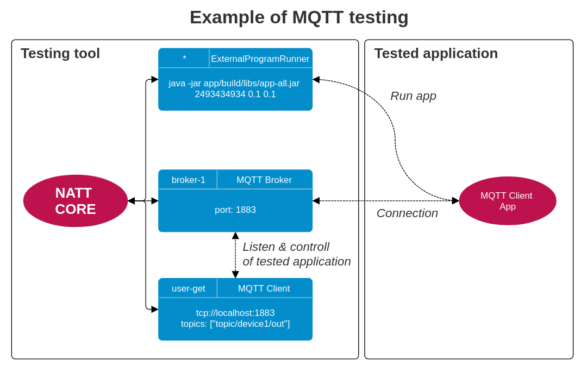
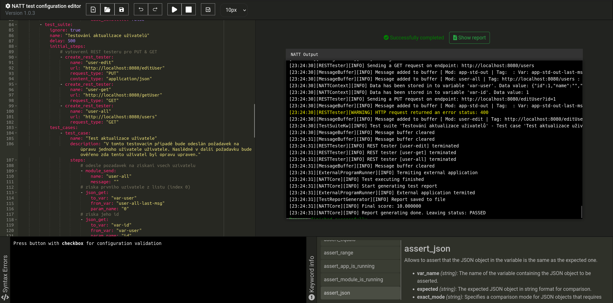
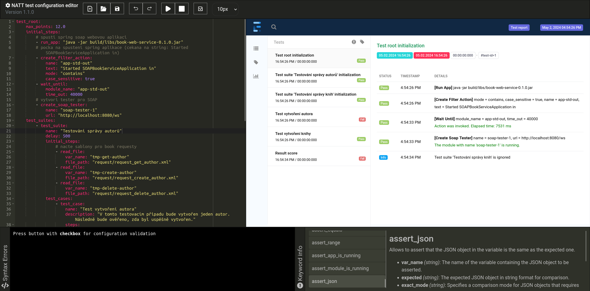
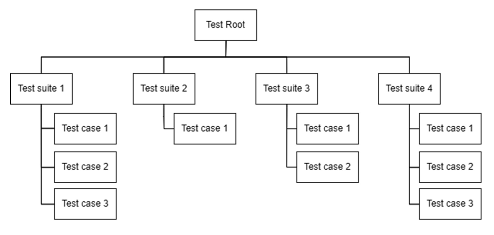

<div align="center">
  
  <h1>Network Application Testing Tool (NATT)</h1>
  <div>
    
    
    
  </div>
  <i>Created as part of the thesis at UTB</i>
</div>

# 💡 Description of testing tool

This **Black Box** Testing Tool is designed for automating the testing and evaluation of tasks without requiring knowledge of the software's internal structure or implementation details. It offers several key features:

- **Universality**: The tool supports testing various types of software applications regardless of their implementation details.
- **Separation**: Emphasizes the separation of the evaluation application and its internal logic from the tested tasks.
- **Independence**: The tool operates independently of external network resources, allowing it to create virtual servers and clients for testing purposes.
- **Flexibility**: Users can easily define new test sets using specific keywords in the configuration.

## What does the tool allow you to test?

* Testing simple __email__ sending applications
* Testing __clients__ using the unencrypted telnet protocol
* Testing __servers__ using the unencrypted telnet protocol
* Testing applications communicating through __REST API__
* Testing __SOAP web services__
* Testing __MQTT clients__
* Testing __web crawlers__

## Testing diagrams 

These two diagrams illustrate how application testing is conducted using the **NATT** black box testing tool. On the left side, there is the testing tool which communicates with the tested application through modules (colored blue in the picture). The communication is then evaluated for the purpose of testing. It is verified whether the tested application behaves according to defined expectations.



**The testing tool offers several different modules that can be created and combined as needed for the specific testing requirements.** 



## Supports running test on **localhost** or in **CI/CD** pipeline

Basic GitLab CI/CD pipeline configuration with automatic test execution. The repository must contain the NATT.jar file as well as the configuration with the test suites.

```yaml
image: gradle:alpine

before_script:
  - GRADLE_USER_HOME="$(pwd)/.gradle"
  - export GRADLE_USER_HOME

stages:
  - build
  - test

build_application:
  stage: build
  script:
    - ./gradlew build
  artifacts:
    paths:
      - app/build/libs/*.jar
  allow_failure: false

black_box_testing:
  stage: test
  script:
    - java -jar NATT.jar -c test-config.yaml
  artifacts:
    paths:
      - test_report.html
  dependencies:
    - build_application
  allow_failure: false
```

## How to run testing tool

For help, specify the -h or --help argument.

```bash
java -jar NATT.jar -c <path-to-test-config>
```

## Future improvements

* The possibility of defining your own keywords
* The possibility of launching more than one external applications at one time
* Add path variable support for REST API testing
* Add more testing options when testing the web crawler
* Add additional modules for testing other types of applications: client testing using SSL, UI testing, ...

# 🔧 Configuring of the Testing Tool

In order to ensure the versatility of our black box testing tool, we've devised a straightforward method for users to convey precisely what tasks they want the tool to undertake. This is achieved through the utilization of YAML-formatted configurations for test sets. These configurations serve as blueprints, enabling the tool to execute tasks reliably and efficiently.

The configuration language of our tool is designed to be intuitive, comprising a set of keywords that users can easily manipulate to tailor their testing requirements. Writing configurations for our tool is akin to crafting configurations for GitLab CI/CD pipelines, ensuring familiarity and ease of use for those experienced with such processes.

## Configuration editor

The testing tool has its own configuration language. The language is written in YAML format. You can write the configuration in your own editor or in the editor available in this repository specifically for this tool. The editor allows for easy configuration writing with code auto-completion and many other features. It is also possible to run tests directly within the editor.

Run configuration editor on Linux:

```bash
cd config-editor

chmod +x run.sh

./run.sh
```

Run configuration editor on Windows:

```bash
cd config-editor

start run.bat
```

> Editor layout with output terminal



> Editor layout with final test report



## 🧩 Understanding Test Structures

Let's dive into the structure of tests in our tool. The image below this text shows a diagram of our test framework, the core of which comes from the Test Root node. This basic element, paramount in any configuration, determines the overarching setting for the testing process. All test suites are defined in this root element.



# 📩 Variables and Received Messages

During testing, you have the flexibility to work with variable contents or with a message buffer containing all messages received during testing. The content of the received message buffer is automatically cleared upon the completion of each test case. Variables are only accessible within the context in which they were created. Therefore, if a variable is created within a test case, it will only be available within that specific test case. There's no need to declare a variable before writing to it; simply input the desired content, and if it doesn't exist, it will be automatically created.

### Important:
* **Variable** - Contains arbitrary data into which information is inserted during test execution. These variables are automatically populated by the tool. The variable **'(module-name)-last-msg'** holds the content of the message received last by a given module. The variable **'(module-name)-action-msg'** contains the content of the message that triggered the termination of the 'wait_until' function.

* **Message Buffer** - Contains all messages received during the entire testing duration. Messages are accessible only within the scope of a test case.

> **(module-name)** is replaced with the unique name of the module. The name of the module is always defined when it is created

# 🔠 Inserting Variables into Strings

Accessing the content of variables can be achieved using specific keywords tailored for this purpose, or their values can be directly inserted into any parameter of any keyword in the configuration. However, the parameter must be of string type. Simply insert the name of the variable preceded by **'$'** into the desired string. For example, in the following manner:  **"Text $var1 Text"**. Name of variable is **"var1"**.

# 🔑 Keywords

This section provides a brief description of all the keywords that the tool allows execution of. Due to the extensive scope, only a basic description will be provided here. Detailed descriptions and parameter explanations can be found in the documentation.

Each keyword has a unique name and a set of parameters that must be configured. A keyword can contain any number of parameters. Parameters can be of type string, boolean, double, long, or list. For lists, all values must be of the same type. The value of a parameter can also contain additional nested keywords.


## Main Keywords

This set comprises all the keywords that directly define the testing structure.

1. **`test_root` – Marks the root element of the test configuration. It must be located at the beginning of the testing configuration. Tests start executing from this point.**
   - `max_points`: *Type*: float, *Description*: Maximum points for the test.
   - `initial_steps`: *Type*: list | not required, *Description*: Initial steps for all test suites. These steps are performed only once at the beginning and then the test suites are executed.
   - `test_suites`: *Type*: list, *Description*: List of test suites.
2. **`test_suite` – Used to define a testing suite.**
   - `name`: *Type*: string, *Description*: Name of the test suite.
   - `delay`: *Type*: long | not required, *Description*: Delay between executed test cases. After finishing of the test case, it will wait for the specified time. (default: 500 ms)
   - `initial_steps`: *Type*: list | not required, *Description*: Initial steps for the test suite. These steps are performed only once at the beginning.
   - `test_cases`: *Type*: list, *Description*: List of test cases.
3. **`test_case` – Allows the definition of individual test cases.**
   - `name`: *Type*: string, *Description*: Name of the test case.
   - `description`: *Type*: string, *Description*: Description of the test case.
   - `steps`: *Type*: list, *Description*: Steps to execute in the test case.


## Keywords for Controlling External Applications

This set includes keywords that enable working with an external application. It's primarily designed for launching and communicating with the tested application.

1. **`run_app` - Launches the application. At any given time, only one external application can run. It allows the definition of arguments to be passed to the application upon its launch.**
   - `default`: *Type*: string, *Description*: Command to run the application. Can run only one application at a time.
2. **`run_app_later` - Launches the application with a time delay. This operation is asynchronous. Again, only one external application can run at a time.**
   - `command`: *Type*: string, *Description*: Command to run the application. Can run only one application at a time.
   - `delay`: *Type*: long, *Description*: Time after which the application starts.
3. **`reload_app` - Stops the currently running application and restarts it.**
   - `default`: *Type*: string, *Description*: Command to reload the application.
4. **`standard_stream_send` - Sends a message to the running application via standard streaming.**
   - `name`: *Type*: string, *Description*: Message to send through the standard stream.

## General Keywords

This set encompasses keywords for working with variables, waiting, conditional waiting, and more.

1. **`wait` - Pauses the test execution for a defined duration.**
   - `default`: *Type*: integer, *Description*: Time to wait in milliseconds.
2. **`wait_until` - Waits until a specific action occurs, triggered by the reception of a message from a certain communication module. It can be extended with filtering conditions. The content of the message that triggered the action is automatically stored in a variable for potential testing.**
   - `module_name`: *Type*: string, *Description*: The module that should trigger the action. You can specify multiple modules this way: module-1 & module-2.
   - `time_out`: *Type*: integer | not required, *Description*: Maximum waiting time in milliseconds. (default: 10 000 ms)
3. **`store_to_var` - Retrieves and stores the content of a specific message from the message buffer into the chosen variable. If multiple messages match the specified search conditions, the variable stores the first one found, i.e., the one received first.**
   - `var_name`: *Type*: string, *Description*: Name of the variable to store the value of the message.
   - `module_name`: *Type*: string, *Description*: The module from which the message was received.
   - `text`: *Type*: string | not required, *Description*: Text that must be included in the message. (default: "")
   - `tag`: *Type*: string | not required, *Description*: Required tag of the message. (default: "")
   - `mode`: *Type*: string | not required, *Description*: Finding mode. There are these modes: "equals", "contains", "startswith", "endswith". (default: equals)
   - `case_sensitive`: *Type*: boolean, *Description*: Whether the filter should be case sensitive.
4. **`count_and_store` - Counts the number of received messages during a single test case and saves this count into a variable.**
   - `var_name`: *Type*: string, *Description*: Variable to store the count.
   - `module_name`: *Type*: string, *Description*: Module whose received messages will be counted.
5. **`read_file` - Reads the content from the specified file on the local device and stores its value into the defined variable.**
   - `var_name`: *Type*: string, *Description*: Variable to store the file content.
   - `file_path`: *Type*: string, *Description*: Path to the file to be read.
6. **`set_var` - Sets the specified variable to the defined content.**
   - `var_name`: *Type*: string, *Description*: Variable to store the value.
   - `value`: *Type*: string, *Description*: The value that will be stored in the variable.
7. **`replace` - Retrieves the content of a specific variable, replacing all desired words with their replacements. The result is stored in another variable.**
   - `to_var`: *Type*: string, *Description*: Variable to store the modified text.
   - `from_var`: *Type*: string, *Description*: Variable containing the original text.
   - `str_from`: *Type*: list, *Description*: String to be replaced in the original text.
   - `str_to`: *Type*: list, *Description*: String to replace occurrences of `str_from` in the original text.
8. **`write_file` - Writes the defined content into a file on the local device.**
   - `file_path`: *Type*: string, *Description*: The path to the file where the content will be written.
   - `content`: *Type*: string, *Description*: The content to be written to the file.
9.  **`clear_buffer` - Clears the content of the message buffer. It's possible to clear the buffer content for all modules or for a specific one.**
    - `default`: *Type*: string, *Description*: Specific module name, or symbol "*" for all modules.
10. **`json_get` - Extracts the value of a specified attribute from the content of a variable in JSON format. It's possible to access array indices or to traverse multiple levels in one step.**
    - `to_var`: *Type*: string, *Description*: Variable to store the extracted value.
    - `from_var`: *Type*: string, *Description*: Variable containing the JSON structure.
    - `param_name`: *Type*: string, *Description*: Name of the parameter to extract from the JSON. If the structure is a list, specify an index to get one element. It is also possible to approach a certain parameter hierarchically in depth, when the parameter names are separated by ":". For example: parent_param:child_param.
11. **`buffer_get` - Retrieves the content of a single message from the message buffer of a specific module. The message is accessed using an index, and its content is stored in the defined variable.**
    - `var_name`: *Type*: string, *Description*: Variable to store the extracted message value.
    - `module_name`: *Type*: string, *Description*: Module name, its message buffer will be accessed.
    - `index`: *Type*: long, *Description*: Index of the message whose value will be extracted from the buffer into a variable. When the index is negative, it indexes from the back of the buffer. -1 is the last index of the buffer. At the last position is the last received message.


## Keywords for Assertion Definition

This set comprises keywords that allow the definition of assertions that must be met during testing.

1. **`assert_string` - Verifies if a variable contains the expected string.**
   - `var_name`: *Type*: string, *Description*: Variable to perform the assertion on.
   - `expected`: *Type*: string, *Description*: The expected string.
   - `mode`: *Type*: string | not required, *Description*: Comparison mode. There are these modes: "equals", "contains", "startswith", "endswith". (default: equals)
   - `case_sensitive`: *Type*: boolean | not required, *Description*: Determines if the comparison should be case sensitive. (default: true)
   - `result`: *Type*: boolean | not required, *Description*: It determines the expected outcome of the assertion. (default: true)
2. **`assert_lower` - Checks if a numeric variable is lower than the expected value.**
   - `var_name`: *Type*: string, *Description*: Variable to perform the assertion on.
   - `value`: *Type*: float, *Description*: The upper limit for the variable value.
   - `result`: *Type*: boolean | not required, *Description*: It determines the expected outcome of the assertion. (default: true)
3. **`assert_larger` - Checks if a numeric variable is larger than the expected value.**
   - `var_name`: *Type*: string, *Description*: Variable to perform the assertion on.
   - `value`: *Type*: float, *Description*: The lower limit for the variable value.
   - `result`: *Type*: boolean | not required, *Description*: It determines the expected outcome of the assertion. (default: true)
4. **`assert_equals` - Checks if a variable equals the expected number. It's possible to set a certain tolerance range.**
   - `var_name`: *Type*: string, *Description*: Variable to perform the assertion on.
   - `value`: *Type*: float, *Description*: Expected value of the variable.
   - `tolerance`: *Type*: float, *Description*: Permissible deviation from the expected value.
   - `result`: *Type*: boolean | not required, *Description*: It determines the expected outcome of the assertion. (default: true)
5. **`assert_range` - Verifies if the sequence of received messages from two modules falls within a specified segment. Simple comparison rules can also be defined for comparison.**
   - `module1_name`: *Type*: string, *Description*: First module involved in the assertion.
   - `module2_name`: *Type*: string, *Description*: Second module involved in the assertion.
   - `start`: *Type*: integer, *Description*: Start index for the range check.
   - `count`: *Type*: integer, *Description*: Number of values to check within the range.
   - `rule`: *Type*: string, *Description*: Message content comparison rule. Format is: <message separator>|<X>;<X>;... Where is <X> is # (equals), ? (arbitrary), number 0-100 diff tolerance.
   - `result`: *Type*: boolean | not required, *Description*: It determines the expected outcome of the assertion. (default: true)
6. **`assert_app_is_running` - Verifies if an external application is currently running.**
   - `default`: *Type*: boolean | not required, *Description*: It determines the expected outcome of the assertion. (default: true)
7. **`assert_module_is_running` - Verifies if a specific module is currently running.**
   - `module_name`: *Type*: string, *Description*: Name of module.
   - `result`: *Type*: boolean | not required, *Description*: It determines the expected outcome of the assertion. (default: true)
8. **`assert_json` - Allows verification if the JSON object in a variable is identical to the expected JSON object.**
   - `var_name`: *Type*: string, *Description*: The name of the variable containing the JSON object to be asserted.
   - `expected`: *Type*: string, *Description*: The expected JSON object in string format for comparison.
   - `exact_mode`: *Type*: string, *Description*: Specifies a comparison mode for JSON objects that requires strict equality between expected and actual JSON. If is false, it only compares parameters that are in expected JSON. (default: false)
   - `result`: *Type*: boolean | not required, *Description*: It determines the expected outcome of the assertion. (default: true)

## Keywords for Working with Modules

This set includes keywords that enable working with communication modules.

1. **`create_telnet_client` - Creates a module that launches a new virtual Telnet client.**
   - `name`: *Type*: string, *Description*: Unique name for the module.
   - `host`: *Type*: string | not required, *Description*: Hostname or IP address to connect to. (default: localhost)
   - `port`: *Type*: integer | not required, *Description*: Port number on the host to connect to. (default: 23)
2. **`create_telnet_server` - Creates a module that launches a virtual Telnet server.**
   - `name`: *Type*: string, *Description*: Unique name for the module.
   - `port`: *Type*: integer | not required, *Description*: Port number to listen on. (default: 23)
3. **`create_web_crawler` - Creates a module that launches a web crawler.**
   - `name`: *Type*: string, *Description*: Unique name for the module.
   - `start_url`: *Type*: string, *Description*: URL to start crawling from.
   - `max_depth`: *Type*: integer, *Description*: Maximum depth to crawl.
   - `analyzer`: *Type*: string, *Description*: Analyzer to use for parsing the web pages.
4. **`create_email_server` - Creates a module that launches a virtual email server.**
   - `name`: *Type*: string, *Description*: Unique name for the module.
   - `port`: *Type*: integer, *Description*: Port number on which the email server will listen.
5. **`create_rest_tester` - Creates a module that launches an HTTP client for testing REST APIs.**
   - `name`: *Type*: string, *Description*: Unique name for the module.
   - `url`: *Type*: string, *Description*: URL of the REST API to test.
   - `request_type`: *Type*: string, *Description*: Type of HTTP request to send (GET, POST, etc.).
   - `content_type`: *Type*: string, *Description*: Data type in request. (default: application/json).
6. **`create_soap_tester` - Creates a module for testing SOAP services.**
   - `name`: *Type*: string, *Description*: Unique name for the module.
   - `url`: *Type*: string, *Description*: URL of the SOAP service to test.
7. **`create_mqtt_client` - Creates a module that launches a virtual MQTT client.**
   - `name`: *Type*: string, *Description*: Unique name for the module.
   - `topics`: *Type*: array | not required, *Description*: List of topics to subscribe to. (default: empty)
   - `broker_url`: *Type*: string | not required, *Description*: URL of the MQTT broker to connect to. (default: tcp://localhost:1883)
8. **`create_mqtt_broker` - Creates a module that launches an MQTT broker.**
   - `name`: *Type*: string, *Description*: Unique name for the module.
   - `port`: *Type*: integer | not required, *Description*: Port number for the MQTT broker. (default: 1883)
9.  **`termite_module` - Terminates a running module that is no longer needed.**
   - `default`: *Type*: string, *Description*: Name of the module to terminate.
10. **`module_send` - Sends a message using a specific module.**
    - `name`: *Type*: string, *Description*: Name of the sending module.
    - `message`: *Type*: string, *Description*: Message to send.
    - `delay`: *Type*: long, *Description*: Delay with which the message will be sent.
11. **`create_filter_action` - Creates a filter for actions triggered upon message reception. Text content can be filtered.**
    - `name`: *Type*: string, *Description*: Name of module.
    - `text`: *Type*: string, *Description*: Text to filter on.
    - `tag`: *Type*: string | not required, *Description*: Tag of message. (default: "")
    - `mode`: *Type*: string | not required, *Description*: Filter mode. There are this modes: "equals", "contains", "startswith", "endswith". (default: equals)
    - `case_sensitive`: *Type*: boolean, *Description*: Whether the filter should be case sensitive. (default: true)
12. **`clear_filter_actions` - Removes all action filters for a specific module.**
    - `default`: *Type*: string, *Description*: Name of module.

# 📦 Working with Communication Modules

Each module has its specific behavior and ways in which it needs to be handled. This section describes each of them and the methods to properly utilize their functionality when writing testing configurations.

Upon receiving a message by any module, its content is appropriately processed and inserted into the message buffer. In all cases, the content of this last received message is also stored in a variable with the following name format: "<module-name>-last-msg". Using this variable can significantly simplify configuration writing in certain cases.

## External Application Launcher
This module is automatically created before the actual testing begins, and it's not necessary to create it manually. It's not possible to create multiple instances of this module.

For message sending use **'standard_stream_send'** instead of **'module_send'**.

Messages received by this module are inserted into the message buffer. The tag of each inserted message is set to an empty value.

## Telnet Client Module
This module must be created before its functionalities are utilized during testing. Multiple instances of this module can exist within a testing suite. The same applies to all other modules unless stated otherwise.

Messages sent using the 'module_send' keyword to this module **don't require any specific format**. It sends any passed text string.

Messages received by this module are inserted into the message buffer. The tag of each inserted message is set to an empty value.

## Telnet Server Module
For the Telnet server, messages sent using the 'module_send' keyword **don't require any specific format**. It sends any passed text string to all connected clients.

All messages from clients received by this module are inserted into the message buffer. The tag of each inserted message is set to the ID of the client that sent the message. The client ID follows the format **"client-#"** where **#** represents the client number. The client number depends on the order in which they connected to the server. The first connected client will have the ID **"client-1"**, the second will have  **"client-2"**, and so on.

## SMTP Email Server Module
This module **does not support sending** messages using the 'module_send' keyword. It only starts the email server and accepts emails.

The content of all emails received by this module is inserted into the message buffer. The tag of each inserted message is set to the **subject value** of the respective email.

## REST Tester Module
For the REST tester module, the message content sent using the 'module_send' keyword must **have a specific format**. The text sent by this module can contain multiple parameters. For this purpose, the text in the message must be in the following format: <code>**<name_1>=<value_1>;<name_2>=<value_2>**</code>

Where **"name"** is the parameter name to be inserted into the query string. If this name starts with the prefix **'#'**, its content will be inserted into the request body. 
All responses to requests from the server received by this module are inserted into the message buffer in **JSON format**. The tag of each inserted message is set to the **endpoint address** from which the response was received.

## SOAP Tester Module
For the SOAP tester module, the message content sent using the 'module_send' keyword must **have a specific format**. The sent request content must be in XML format, and its structure must be as required by the tested SOAP web service. 
The request can be entered manually or loaded directly from a prepared file, and the loaded content can be sent using this method. 

All responses to requests from the server received by this module are inserted into the message buffer. Each message is converted **from XML to JSON format before insertion**. The tag of each inserted message is set to the **endpoint address** from which the response was received.

## MQTT Client Module
For the MQTT client module, the message content sent using the 'module_send' keyword must **have a specific format**. The message must specify the topic and the content of the message. The format is as follows: <code>**(topic):(Message)**</code>

Messages received by this module are inserted into the message buffer as they were received. The tag of each message is set to the value of the **topic** from which the message was received.

## MQTT Broker Module
This module **does not support** sending messages using the 'module_send' keyword. The module simply starts an MQTT broker and facilitates its operation. The module does not allow receiving incoming communication either. It acts solely as a mediator for MQTT communication between clients connected to it.

# 🧪 Test Configuration Samples

**More examples in this direcotry [configuration-examples](./configuration-examples)**

## Testing of simple application for email sending

This configuration defines a set of automatic tests to evaluate the functionality of the email client application for sending email. The tests include scenarios related to sending emails. Each test case is designed to simulate different user interactions and verify that the client behaves as expected.

```yaml
test_root:
  max_points: 4.0
  initial_steps: 
    - create_email_server:
        name: "server-1"
        port: 9999
  test_suites: 
    - test_suite:
        name: "Basic Email Sending Test"
        delay: 500
        test_cases: 
          - test_case:
              name: "Email Sending Test"
              description: "Tests the sending of one email. The content of the sent email is not verified, only whether it arrived at the server."
              steps: 
                - run_app: "java -jar app/build/libs/app.jar localhost 9999 sender@email.com recipient@email.com Subject1 'Text Message'"
                - wait_until:
                    module_name: "server-1"
                    time_out: 5000
                - count_and_store:
                    var_name: "var-1"
                    module_name: "server-1"
                - assert_equals:
                    var_name: "var-1"
                    value: 1
                - wait: 500
          - test_case:
              name: "Email Content Test 1"
              description: "Tests the sending of one email. After receiving the email, its content is verified."
              steps: 
                - run_app: "java -jar app/build/libs/app.jar localhost 9999 sender@email.com recipient@email.com Subject1 'Text Message'"
                - wait_until:
                    module_name: "server-1"
                    time_out: 5000
                - store_to_var:
                    var_name: "var-1"
                    module_name: "server-1"
                    tag: "Subject1"
                    mode: "equals"
                - assert_string:
                    var_name: "var-1"
                    expected: "Text Message"
                    mode: "equals"
                    case_sensitive: true
                - wait: 500
          - test_case:
              name: "Email Content Test 2"
              description: "Tests the sending of one email. After receiving the email, its content is verified."
              steps: 
                - run_app: "java -jar app/build/libs/app.jar localhost 9999 sender@email.com recipient@email.com Subject1111 'Lorem ipsum dolor sit amet, consectetuer adipiscing elit. Proin mattis lacinia justo. Curabitur bibendum justo non orci. Sed ut perspiciatis unde omnis iste natus error sit voluptatem accusantium doloremque laudantium, totam rem aperiam, eaque ipsa quae ab illo inventore veritatis et quasi architecto beatae vitae dicta sunt explicabo.'"
                - wait_until:
                    module_name: "server-1"
                    time_out: 5000
                - store_to_var:
                    var_name: "var-1"
                    module_name: "server-1"
                    tag: "Subject1111"
                    mode: "equals"
                - assert_string:
                    var_name: "var-1"
                    expected: "Lorem ipsum dolor sit amet, consectetuer adipiscing elit. Proin mattis lacinia justo. Curabitur bibendum justo non orci. Sed ut perspiciatis unde omnis iste natus error sit voluptatem accusantium doloremque laudantium, totam rem aperiam, eaque ipsa quae ab illo inventore veritatis et quasi architecto beatae vitae dicta sunt explicabo."
                    mode: "contains"
                    case_sensitive: true
                - wait: 500
          - test_case:
              name: "Invalid Email Sending Test"
              description: "An email with invalid data is sent through the tested application. It is assumed that the email will not be sent."
              steps: 
                - run_app: "java -jar app/build/libs/app.jar localhost 9999 sender@email.com recipient@email.com"
                - wait: 3000
                - count_and_store:
                    var_name: "var-1"
                    module_name: "server-1"
                - assert_equals:
                    var_name: "var-1"
                    value: 0
                - wait: 500
```

## Testing of telnet client

This configuration describes a series of automated tests designed to assess the functionality of the telnet client application. The tests are structured to verify both the sending and receiving capabilities of the telnet client. Each test case simulates different scenarios to see if the client works correctly under different conditions.

```yaml
test_root:
  max_points: 4.0
  initial_steps: 
    # Start a virtual telnet server on port 9999
    - create_telnet_server:
        name: "tel-server-1"
        port: 9999
  test_suites: 
    - test_suite:
        name: "Message Sending Test"
        delay: 700
        initial_steps: 
          - run_app: "java -jar app/build/libs/app.jar localhost 9999"
          - wait: 200
        test_cases: 
          - test_case:
              name: "Message Sending Test 1"
              description: "The tested telnet client sends several test messages to the server and then verifies whether these messages were delivered correctly."
              steps: 
                # Test application sends messages via std in for sending
                - standard_stream_send: "This is test message 1"
                - wait: 500
                - standard_stream_send: "Next test message"
                - wait: 1200
                # Verify received messages
                - buffer_get:
                    var_name: "var-1"
                    module_name: "tel-server-1"
                    index: 0
                - buffer_get:
                    var_name: "var-2"
                    module_name: "tel-server-1"
                    index: 1
                - assert_string:
                    var_name: "var-1"
                    expected: "This is test message 1"
                    mode: "equals"
                    case_sensitive: true
                - assert_string:
                    var_name: "var-2"
                    expected: "Next test message"
                    mode: "equals"
                    case_sensitive: true
          - test_case:
              name: "Message Sending Test 2"
              description: "The tested telnet client sends many messages to the server in a short time. It will be verified whether all of them were delivered."
              steps:
                # Test application sends messages via std in for sending
                - standard_stream_send: "This is test message 1"
                - standard_stream_send: "This is test message 2"
                - standard_stream_send: "This is test message 3"
                - standard_stream_send: "This is test message 4"
                - standard_stream_send: "This is test message 5"
                - wait: 1200
                # Verify received messages
                - store_to_var:
                    var_name: "var-1"
                    module_name: "tel-server-1"
                    text: "This is test message 3"
                    mode: "equals"
                    case_sensitive: true
                - assert_string:
                    var_name: "var-1"
                    expected: "This is test message 3"
                    mode: "equals"
                    case_sensitive: true
                - count_and_store:
                    var_name: "var-2"
                    module_name: "tel-server-1"
                - assert_equals:
                    var_name: "var-2"
                    value: 5
          - test_case:
              name: "Message Sending Test 3"
              description: "Several messages will be sent. It will be tested whether the list of received messages does not contain messages that were not sent (but were sent by the previous TC)."
              steps:
                # Test application sends messages via std in for sending
                - standard_stream_send: "This is test message 1"
                - standard_stream_send: "This is test message 3"
                - standard_stream_send: "This is test message 5"
                - wait: 1200
                # Verify that the list of received messages does not contain a message that was not sent (but was sent by the previous TC)
                - store_to_var:
                    var_name: "var-1"
                    module_name: "tel-server-1"
                    text: "This is test message 4"
                    mode: "equals"
                    case_sensitive: true
                - assert_string:
                    var_name: "var-1"
                    expected: ""
                    mode: "equals"
                    case_sensitive: true
    - test_suite:
        name: "Message Receiving Test"
        delay: 700
        initial_steps: 
          - run_app: "java -jar app/build/libs/app.jar localhost 9999"
          - wait: 200
        test_cases: 
          - test_case:
              name: "Message Receiving Test 1"
              description: "The virtual server sends a message to the connected telnet client, and it will be tested whether the client received this message correctly."
              steps: 
                # Send a message to the test application
                - module_send:
                    name: "tel-server-1"
                    message: "This is message from server"
                - wait: 1200
                # Verify received content
                - buffer_get:
                    var_name: "var-1"
                    module_name: "app-std-out"
                    index: 0
                - assert_string:
                    var_name: "var-1"
                    expected: "This is message from server"

```


