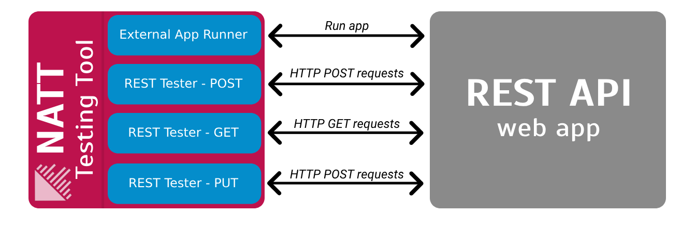
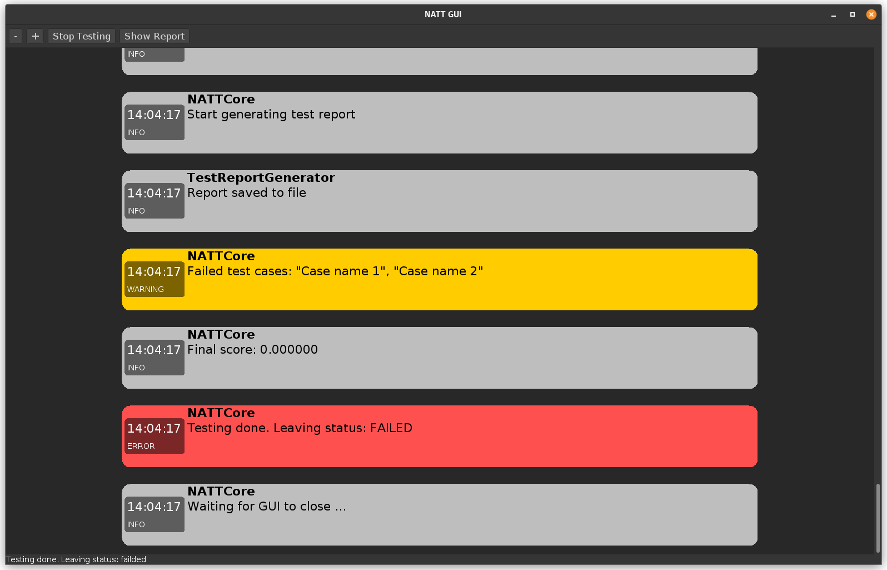
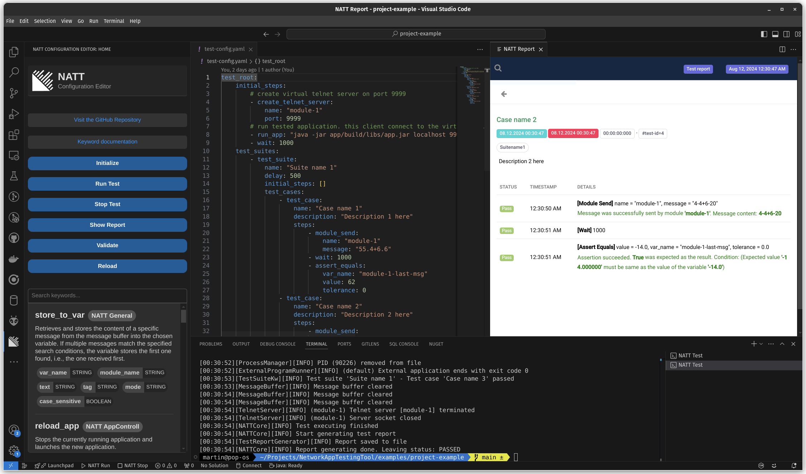
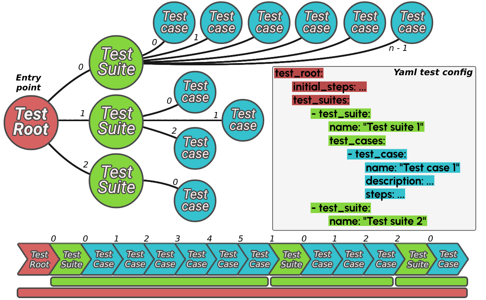

<div align="center">
  
  <h1>Network Application Testing Tool (NATT)</h1>
  <div>
    
    
    
    
    
    
  </div>
  <i>Created as part of the thesis at <b>UTB FAI</b></i>
  <br>
  <i>Short info about this thesis <a href="./doc/latex-poster/poster.pdf">here</a></i>
</div>

# 💡 Description of testing tool

This **Black Box Testing** Tool is designed for automating the testing of **network application** or **console applications**. It tests how applications **interact with their environment** and does not test the internal behavior of the application. 

> **Video tutorial on YouTube: [How to use NATT?](https://youtu.be/QWM2mg2x6cA)**

**It offers several key features:**

- **🌐 Universality**: The tool supports testing various types of software applications regardless of their implementation details.
- **🔍 Separation**: Emphasizes the separation of the evaluation application and its internal logic from the tested tasks.
- **🔌 Independence**: The tool operates independently of external network resources (servers, clients, ...), allowing it to create virtual servers and clients for testing purposes.
- **🛠️ Flexibility**: Users can easily define new test sets using specific keywords in the configuration.
- **🚀 Deployment Versatility:** The tool can be run on localhost or integrated into CI/CD pipelines on platforms like GitLab and GitHub, ensuring seamless testing across different environments.
- **📦 Plugin Support:** The tool supports the creating of custom plugins, allowing users to define their own keywords, communication modules or more for enhanced functionality. Tutorial is available [here](./examples/plugin-example).



## 🔍 What does the tool allow you to test?

* Testing simple __email__ sending applications
* Testing __clients__ that use the telnet protocol
* Testing __servers__ that use the telnet protocol
* Testing applications that use __REST API__
* Testing __SOAP web services__
* Testing __MQTT clients__
* Testing __Web crawlers__
* Testing the application through the __standard stream__
> The __tested__ applications can be written __in any language__

## 🚀 Now available as extension in Visual Studio Code!

Available in the [Visual Studio Marketplace](https://marketplace.visualstudio.com/items?itemName=0xM4R71N.natt-configuration-editor)

> Or Launch VS Code Quick Open (Ctrl+P), paste the following command, and press enter: `ext install 0xM4R71N.natt-configuration-editor`


---

## Helpful links

* **Configuration - keyword documentation: [keywords.md](./keywords.md)**

* **VS Code Extension: [NATT Editor for VS Code](https://marketplace.visualstudio.com/items?itemName=0xM4R71N.natt-configuration-editor)**

* **Custom configuration editor: [NATT Configuration Editor](./natt-config-editor)**
  
* **How to create custom plugin for NATT? [plugin-example.md](./examples/plugin-example)**

* Video tutorial on YouTube: [NATT Tutorial](https://youtu.be/QWM2mg2x6cA)
  
* NATT-SPI documentation: [natt-spi](./natt-spi)

* Simple example project: [project-example](./examples/project-example)

* Test suite configuration for all task types: [configuration-examples](./examples/configuration-examples)


## System Requirements

* **Operating System:** Linux, Windows 7 or later, MacOS 10.12 (Sierra) or later

* **Java Development Kit (JDK):** JDK 17 or later

* **Gradle:** Gradle 8.7 or later

## Project Structure

* **natt-spi** - Source code of the NATT SPI (Service Provider Interface)
* **natt** - Source code of the NATT testing tool
* **natt-config-editor** - Source code of the NATT configuration editor
* **natt-vs-code-extension** - Source code of the NATT extension for Visual Studio Code
* **examples** - Examples of NATT configuration files
* **doc** - Documentation resources for this repoository

## How to build the project

1. Build the NATT SPI first using script. This script fist build **NATT SPI library** and than move it to the lib directory of NATT project:

```bash
./build_natt_spi.sh
```

2. Build the **NATT testing tools**. Final build is in the **natt/build/libs** directory:

```bash
./gradlew :natt:build
```

>**You can also use the script that will build the NATT SPI and NATT testing tool: `./full_build.sh`**

>**For successful build you need have installed UTF-8 charset in your system. Testing requires UTF-8 special characters.**

---

## 🧪 Testing diagrams 

These two diagrams illustrate how testing is conducted using the **NATT**. On the left side, there is the testing tool which communicates with the tested application through **virtual created modules** (colored blue in the picture). The **incoming data** from the communication channels is then evaluated for testing purposes. It is verified whether the tested application behaves according to defined expectations.


**The testing tool offers several different modules that can be created and combined as needed for the specific testing requirements.** 


## Supports running test on **localhost** or in **CI/CD** pipeline

Basic GitLab CI/CD pipeline configuration with automatic test execution. The repository must contain the NATT.jar file as well as the configuration with the test suites.

```yaml
image: gradle:jdk17

before_script:
  - GRADLE_USER_HOME="$(pwd)/.gradle"
  - export GRADLE_USER_HOME

stages:
  - build
  - test

build_application:
  stage: build
  script:
    - ./gradlew build
  artifacts:
    paths:
      - app/build/libs/*.jar
  allow_failure: false

black_box_testing:
  stage: test
  script:
    - java -jar NATT.jar -c test-config.yaml
  artifacts:
    paths:
      - test_report.html
  dependencies:
    - build_application
  allow_failure: false
```

## How to run testing tool

For help, specify the -h or --help argument.

```bash
java -jar NATT.jar -c <path-to-test-config>
```

## ⚙️ Arguments

``` -c,--config ```
Specifies the path to the test configuration file to be loaded from the local host. *Example: --config path/to/config.json*

```-gui,--gui```
Runs the tool in GUI mode, displaying the output and logs in an interactive interface.

```-h,--help```
Description: Displays a help message with details on usage and available commands.

```-ht,--host```
Allow to host server for interactive testing. Use --show-servers to list all available options. *Example: --host mqtt-broker*

```-k,--keywords``` Lists all registered testing keywords for use in your configuration files.

```-kd,--keywordDoc``` Lists all registered keywords along with their documentation in JSON format.

```-nc,--net-config``` Provides the path to a network configuration file that will be loaded from a URL. *Example: --net-config https://example.com/config.json*

```-p,--plugins``` Displays a list of all loaded plugins that can be used during testing.

```-ss,--show-servers``` Shows a list of all available servers that can be used (host) for interactive testing.

```-t,--title``` Specifies a title or header for the resulting test report.
*Example: --title "Network Test Results"*

```-v,--validate``` Validates the test suite configuration without executing it.

### NATT GUI

The GUI mode of the NATT tool provides a user-friendly interface for showing logs and displaying the test results. To show the GUI use the **--gui* argument.



---

# 🔧 Configuring of the Testing Tool

To ensure the versatility of this black box testing tool, a simple method has been devised to allow users **to define exactly what tasks** the tool should perform. This is achieved by using test suite configurations in **YAML format**. 

The configuration language of this tool is designed to be intuitive, comprising a set of keywords that users can **easily manipulate** to tailor their testing requirements. Writing configurations for the tool is akin to writing configurations **for GitLab CI/CD pipelines**, ensuring familiarity and ease of use for those experienced with such processes.

## 🚀 VS Code extension for NATT 

> **Extension README [here](./natt-vscode-extension)**

To further streamline the process of implementing and managing your test configurations, is available a **Visual Studio Code extension**. This extension provides this features:

* **Running Tests:** Running the test directly in the VS code environment.
* **Code Completion:** Intelligent suggestions are provided as you type, helping to speed up the writing process and reduce errors.
* **Snippets:** Predefined snippets are available to quickly insert common configuration patterns and structures.
* **Integrated Commands:** Easily initialize your test environment with commands directly accessible within the VS Code command palette.



## Configuration editor

For NATT black box testing tool was also created simple "IDE". It allows you easily create, edit and test your configurations. 

> **More about it you can find [here](./natt-config-editor/README.md).**

## 🧩 Understanding Test Structures

The image below illustrates how test scenarios are defined for this tool. At the 
beginning is the Test Root node, which is the **entry point** for each test 
scenario. This root node sets the overall context for the testing 
process and includes all test suites within it. 

The diagram illustrates the **context of each test segment** and the 
duration for which variables or resources remain active. On the right side, a simplified
test configuration is shown, which NATT **uses to generate** an acyclic graph that 
is subsequently executed.



# 📩 Variables and Received Messages

During testing, you have the flexibility to work with **variable contents** or with a **message buffer** containing all messages received during testing. The content of the received message buffer is automatically **cleared upon the completion of each test case**. Variables are only accessible within the **context** in which they were created. Therefore, if a variable is created within a test case, it will only be available within that specific test case. There's no need to declare a variable before writing to it; simply input the desired content, and if it doesn't exist, it will be automatically created.

### Important:
* **Variable** - Contains arbitrary data into which information is inserted during test execution. These variables are automatically populated by the tool. The variable **'(module-name)-last-msg'** holds the content of the message received last by a given module. The variable **'(module-name)-action-msg'** contains the content of the message that triggered the termination of waiting (**'wait_until'** keyword).

* **Message Buffer** - Contains all messages received during the entire testing process. Messages are accessible only within the scope of a test case.

> **(module-name)** is the unique name of the module. The name of the module is always defined when it is created

# 🔠 Inserting Variables into Strings

Accessing the content of variables can be achieved using **specific keywords** tailored for this purpose, or their values can be **directly inserted** into any parameter of any keyword in the configuration. However, the parameter must be of string type. Simply insert the name of the variable preceded by **'$'** into the desired string. For example, in the following manner:  **"Text $var1 Text"**. Name of variable is **"var1"**.

# 🔑 Keywords

This section provides a brief description of all the keywords that the tool allows execution of. Each keyword has a unique name and a set of parameters that must be configured. A keyword can contain any number of parameters. Parameters can be of type string, boolean, double, long, or list. For lists, all values must be of the same type. The value of a parameter can also contain additional nested keywords.

All keywords are executed synchronously. If any keyword has a parameter of the "delay" type. Its enable a delayed call, then the keyword is executed asynchronously.

**Description for all keywords you can find here [keywords.md](./keywords.md)**

---

# 📦 Working with Communication Modules

Each module has its **specific behavior** and ways in which it needs to be handled. This section describes each of them and the methods to properly utilize their functionality when writing testing configurations.
s
Upon receiving a message by any module, its content is appropriately processed and inserted into the message buffer. In all cases, the content of this last received message is also stored in a variable with the following name format: **'(module-name)-last-msg'**. Using this variable can significantly simplify configuration writing in certain cases.

## External Application Runner
This module is automatically created before the actual testing begins, and it's not necessary to create it manually. This module is special and does not operate with the same commands as the classic module. 

For message sending use **'standard_stream_send'** or **'module_send'**.

For running external applications use **'run_app'** or **'run_app_later'**.

For stopping external applications use **'termite_module'** or for reload **'reload_app'**.

Messages received by this module are inserted into the message buffer. The tag of each inserted message is set to an empty value.

## Telnet Client Module
This module must be created before its functionalities are utilized during testing. Multiple instances of this module can exist within a testing suite. The same applies to all other modules unless stated otherwise.

Messages sent using the 'module_send' keyword to this module **don't require any specific format**. It sends any passed text string.

Messages received by this module are inserted into the message buffer. The tag of each inserted message is set to an empty value.

## Telnet Server Module
For the Telnet server, messages sent using the 'module_send' keyword **don't require any specific format**. It sends any passed text string to all connected clients.

All messages from clients received by this module are inserted into the message buffer. The tag of each inserted message is set to the ID of the client that sent the message. The client ID follows the format **"client-#"** where **#** represents the client number. The client number depends on the order in which they connected to the server. The first connected client will have the ID **"client-1"**, the second will have  **"client-2"**, and so on.

## SMTP Email Server Module
This module **does not support sending** messages using the 'module_send' keyword. It only starts the email server and accepts emails.

The content of all emails received by this module is inserted into the message buffer. The tag of each inserted message is set to the **subject value** of the respective email.

## REST Tester Module
For the REST tester module, the message content sent using the 'module_send' keyword must **have a specific format**. The text sent by this module can contain multiple parameters. For this purpose, the text in the message must be in the following format: <code>**<name_1>=<value_1>;<name_2>=<value_2>**</code>

Where **"name"** is the parameter name to be inserted into the query string. If this name starts with the prefix **'#'**, its content will be inserted into the request body. 
All responses to requests from the server received by this module are inserted into the message buffer in **JSON format**. The tag of each inserted message is set to the **endpoint address** from which the response was received.

## SOAP Tester Module
For the SOAP tester module, the message content sent using the 'module_send' keyword must **have a specific format**. The sent request content must be in XML format, and its structure must be as required by the tested SOAP web service. 
The request can be entered manually or loaded directly from a prepared file, and the loaded content can be sent using this method. 

All responses to requests from the server received by this module are inserted into the message buffer. Each message is converted **from XML to JSON format before insertion**. The tag of each inserted message is set to the **endpoint address** from which the response was received.

## MQTT Client Module
For the MQTT client module, the message content sent using the 'module_send' keyword must **have a specific format**. The message must specify the topic and the content of the message. The format is as follows: <code>**(topic):(Message)**</code>

Messages received by this module are inserted into the message buffer as they were received. The tag of each message is set to the value of the **topic** from which the message was received.

## MQTT Broker Module
This module **does not support** sending messages using the 'module_send' keyword. The module simply starts an MQTT broker and facilitates its operation. The module does not allow receiving incoming communication either. It acts solely as a mediator for MQTT communication between clients connected to it.

## Web crawler

This module **does not support** sending messages using the 'module_send' keyword. During the creation of this module, the process of analyzing web pages is automatically started. 

After the completion of this process, the output of the analysis is written into the message buffer. The analyzer must be defined when creating the web crawler module. A list of analyzers and how to use them is available in the **keyword documentation**.

