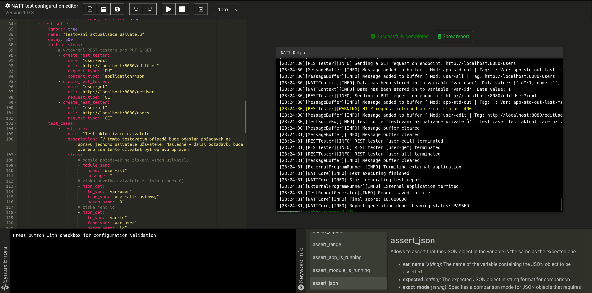
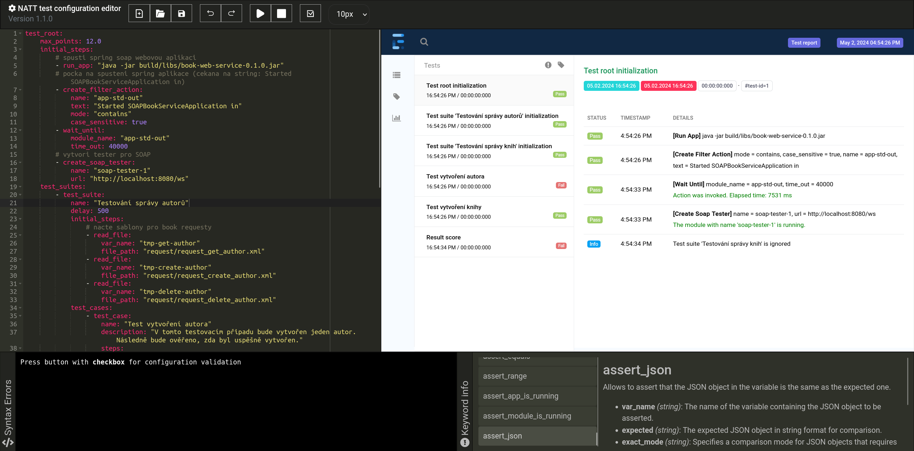

# NATT Configuration editor

**[Go Back](../README.md)**

The testing tool has its own configuration language. The language is written in YAML format. You can write the configuration in your own editor or in the editor available in this repository specifically for this black box testing tool. The editor allows for easy configuration writing with code auto-completion and many other features. It is also possible to run tests directly within the editor.

## How to run?

Run configuration editor on **Linux**:

```bash
cd config-editor

chmod +x run.sh

./run.sh
```

Run configuration editor on **Windows**:

```bash
cd config-editor

start run.bat
```

## Preview

> Editor layout with output terminal



> Editor layout with final test report

