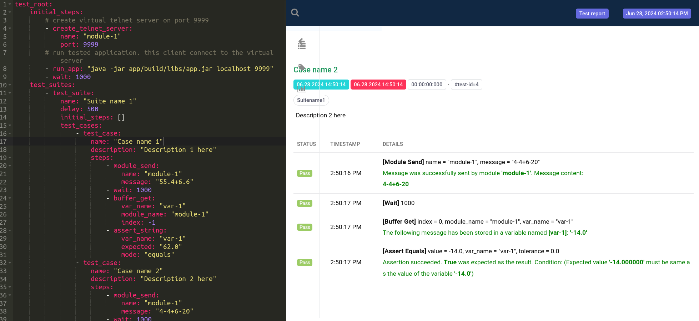

# Example project - Telnet Calculator

**[Go Back](../../README.md)**

This is a simple example project. The tested application is a telnet client to which the server sends a mathematical formula, which the client calculates and sends the result back to the server. 

**Supported formula symbols:** +,- and numbers (44, 23, 4.356)

**The application requires these arguments at startup:** (SERVER-IP) (SERVER-PORT)

This folder contains the source code of the client app and the configuration of test suite for the **NATT testing tool**.

## Important files

NATT black box testing tool: **NATT.jar**

Configuration of test suites: [test-config.yaml](./test-config.yaml)

GitLab CI/CD script: [.gitlab-ci.yml](./.gitlab-ci.yml)

Source code of project: [app](./app)

## How to run on local host?

**Step 1.** Build project 
```
./gradlew build
```

**Step 2.** Run tests using NATT testing tool. NATT.jar & test-config.yaml must by in project root folder
```
java -jar NATT.jar -c test-config.yaml
```

**Step 3.** Check report. NATT testing tool leave report in **test_report.html** file.



## How to run on GitLab

The **GitLab** script will will automatically build the project and start testing process. Current script is only for GitLab, for **Github support** you must change the CI/CD script.
