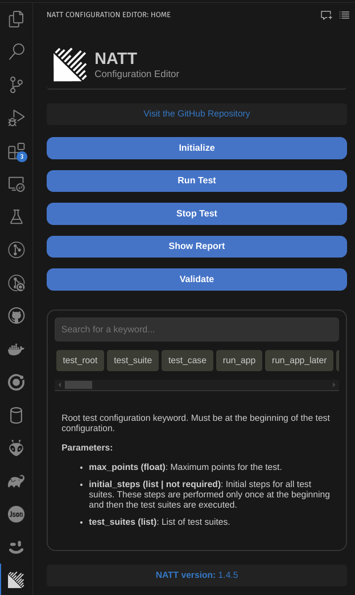
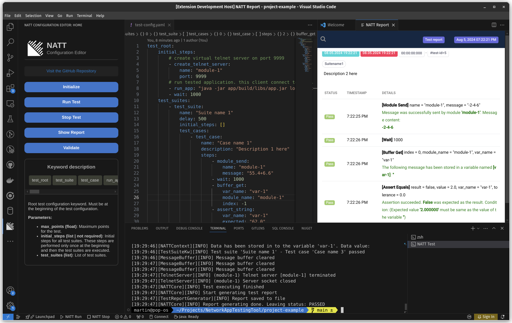

# NATT Configuration Editor

The **NATT Configuration Editor** is a Visual Studio Code extension developed as part of a project at **[TBU FAI](https://www.utb.cz/en/)**. This extension facilitates the creation, editing, and execution of test configuration using the **Network Application Testing Tool (NATT)**. The tool allows users to perform black box testing on various types of software applications.

## 📜 Network Application Testing Tool (NATT)

NATT was created as part of a thesis at TBU FAI. It is a black box testing tool designed for automating the testing and evaluation of tasks. The tool's key features include:

- **🌐 Universality:** Supports testing various types of software applications regardless of their implementation details.
- **🔍 Separation:** Emphasizes the separation of the evaluation application and its internal logic from the tested tasks.
- **🔌 Independence:** Operates independently of external network resources, allowing it to create virtual servers and clients for testing purposes.
- **🛠️ Flexibility:** Users can easily define new test sets using specific keywords in the configuration.

### 🔍 What Does the Tool Allow You to Test?

- Simple **email** sending applications
- **Clients** that use the **Telnet protocol**
- **Servers** that use the **Telnet protocol**
- Applications that use **REST API**
- **SOAP** web services
- **MQTT** clients
- **Web crawlers**
- Applications through the **standard stream**

The tested applications can be written in any language.

> For more information about **NATT**, visit the [NATT GitHub repository](https://github.com/0xMartin/NetworkAppTestingTool).

## 🌟 Features of the NATT Configuration Editor

- **📝 Intuitive Configuration Editor:** Easily create and modify test configurations with syntax highlighting and autocomplete.
- **🧪 Execute Tests:** Directly execute and manage tests from within the extension, streamlining your workflow and providing immediate feedback.
- **📊 Test Report Viewer:** View detailed test reports within VS Code, allowing you to analyze results without leaving your development environment.
- **💡 Code Snippets:** Quickly insert common test configuration snippets to speed up the writing process.

## 🔧 Commands

The extension provides several commands to facilitate testing:

- **🛠️ NATT Init:** Initializes the NATT testing structure by copying necessary configuration and JAR files into your project directory.
- **🚀 NATT Run:** Executes the test configuration using the NATT tool.
- **🛑 NATT Stop:** Stops the currently running test process.
- **📝 NATT Show Report:** Opens and displays the test report.
- **✅ NATT Validate:** Validates the configuration file for syntax errors.

## 📸 Screenshots

The primary side bar contains the main control panel for the extension, with buttons for "Initialize," "Run Test," "Stop Test," and "Validate." The lower section includes a list of keywords used in the NATT configuration.

The VS Code editor showing the configuration file on the left and the test results report on the right. Users can see the outcome of their software tests in the detailed report.

## 🚀 Installation

1. **Install the Extension:** Search for "NATT Configuration Editor" in the Visual Studio Code extensions marketplace and install it.
2. **Open Your Project:** Open the project you want to test in Visual Studio Code.
3. **Initialize the NATT Testing Structure:** Use the `NATT Init` command or the button in the side bar to set up the necessary files for testing.
4. **Run Tests:** Execute your tests directly from the terminal or using the provided commands.
5. **View Reports:** Access detailed test reports within the editor to review and analyze the results.

